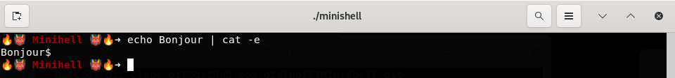
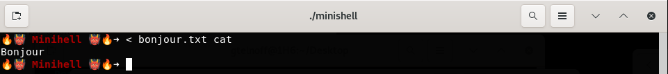
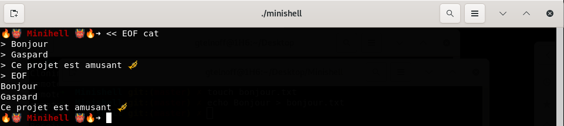
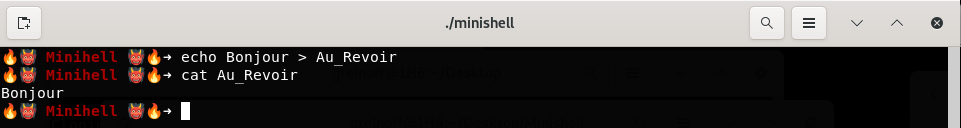
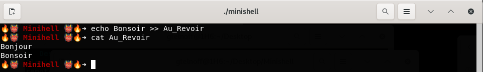

<h1>Minishell</h1>
Minishell is a C-coded shell that takes Bash as a reference. 
<h3>⚠️ Info ⚠️</h3> 
I won't go into all the specific details of each feature, or else my ReadMe will be 10,000 lines long. In most cases, we follow the same principles as Bash, so RTFM.
<h2>Features</h2>
<h3>Pipes</h3>
Pipes allow the flow of data between commands.  

<h3>Redirections</h3>
The principle of redirection is to modify the standard input and output (0 and 1) of commands.  
<b>Simple Input Redirection</b> 
Simple Input Redirection allows passing a file as a parameter to a command. 

<b>HereDoc</b> 
HereDoc allows entering words in the terminal. After entering the delimiter, it sends everything as parameters to the command. 

<b>Simple Output Redirection</b> 
Simple Output Redirection replaces the output and sends the result of the command to the file. 

<b>Append Output Redirection</b> 
Append Output Redirection replaces the output and appends the result of the command to the file. 

<h2>Builtins</h2>
The following commands have been implemented as builtins: <b>echo</b>, <b>cd</b>, <b>pwd</b>, <b>export</b>, <b>unset</b>, <b>env</b>, <b>exit</b>.
<h2>Special Mention</h2>
Example of possible command: 

